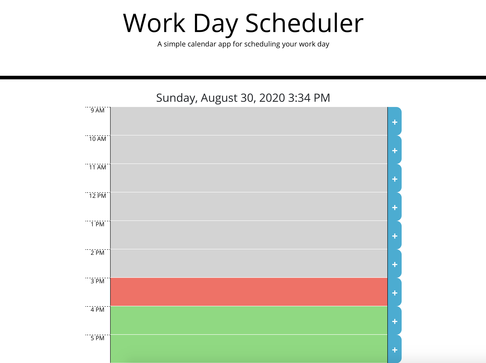

# Day Scheduler

https://srsagehorn.github.io/dayScheduler/

## Description

This application utilizes moment.js to help you schedule your day in real time. It also utilizes local storage to save data on refresh.

The header includes the current date and time. The hours are designated past present and future with respective grey red and green backgrounds.

